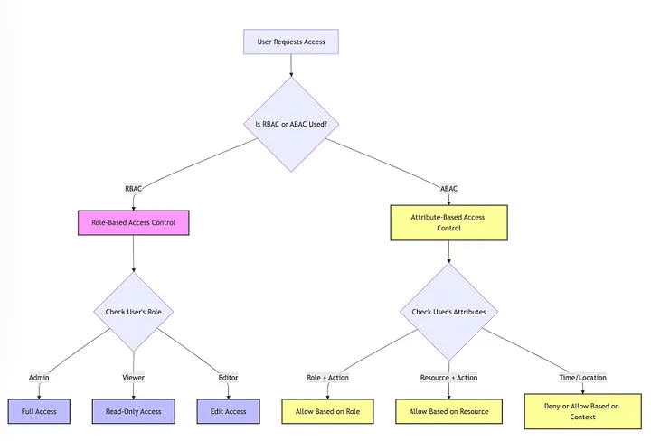

# Attribute Based and Role Based Access Control

## Major components of Attribute based access control
1. Subject attributes  
   Subject refers to user seeking access to resources for performing actions.SO the subejct attributes are attributes that are present in Subject profile like Job type, role etc.
2. Resource attributes  
   Resources refers to objects that subject wants to access.These includes properties like public, confidential, sensitive, creation date, owner , file name etc.
3. Action attributes  
    What subject can do with the resources like read, write, edit, delete.
4. Environmental attributes  
This includes contextual factors like time, location, network protocol, user behaviour patterns etc.

## Libraries
1. CASL
   - [Is this the best NodeJS Authorization Library? | CASL JavaScript Tutorial](https://youtu.be/qMU9c-0UHwM?si=SVqNCLOoe8WBQZas)
   - https://www.permit.io/blog/frontend-authorization-with-nextjs-and-casl-tutorial